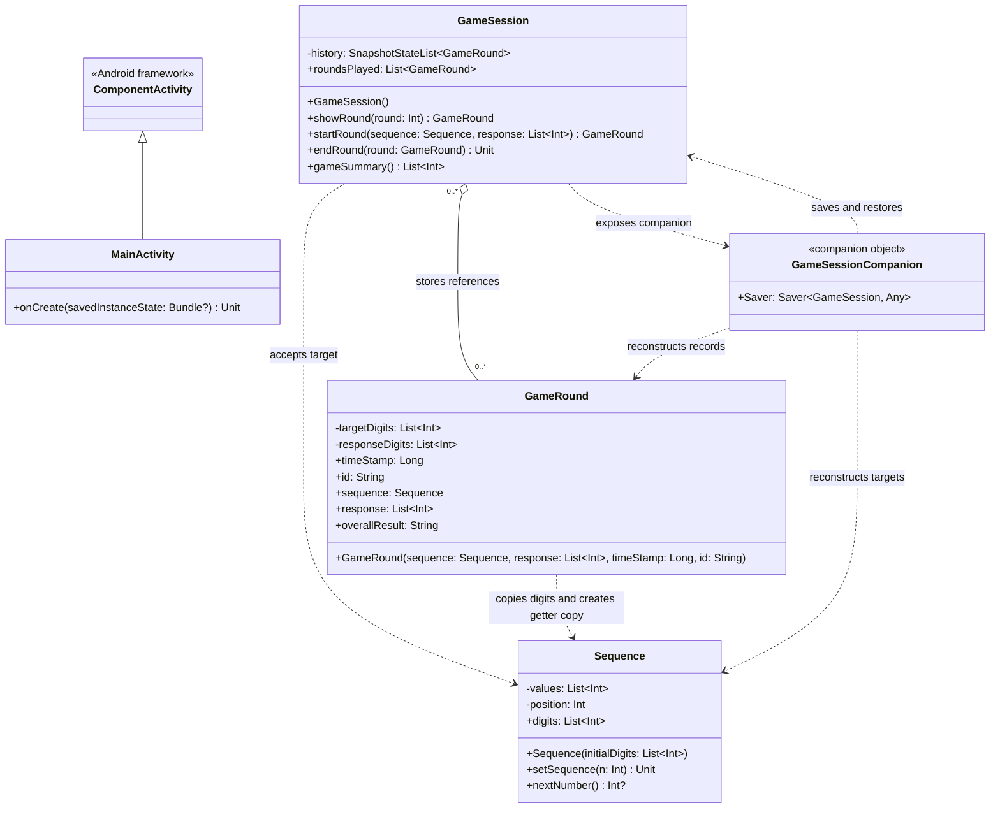
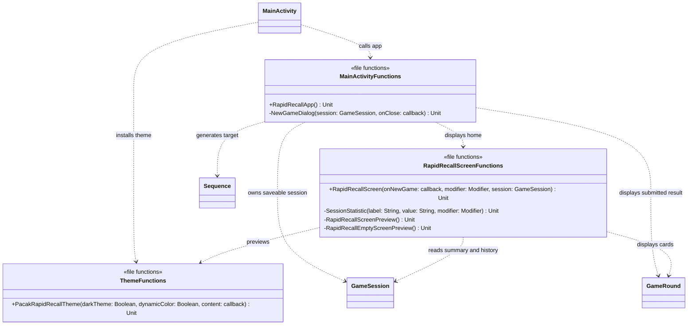
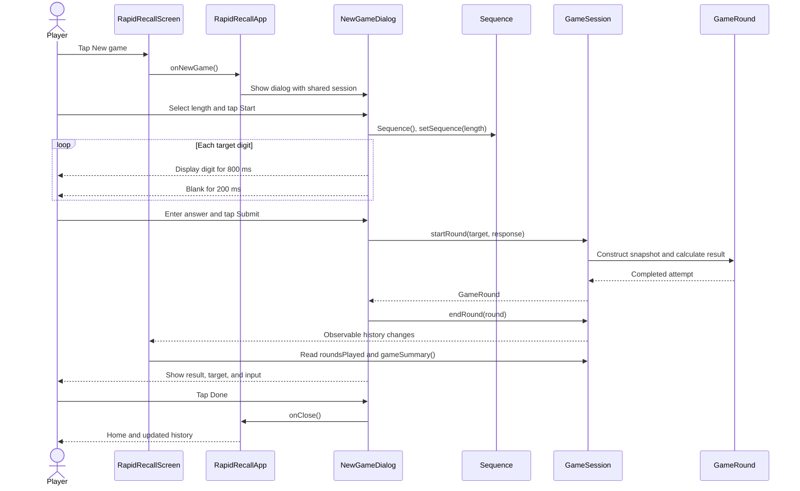

# pacak-RapidRecall UML and design notes

This document describes the current code in `app/src`. The application package is
`com.example.pacak_rapidrecall`; theme functions are in its `ui.theme` subpackage.
Mermaid diagrams can be viewed on GitHub or in a Markdown preview that supports Mermaid.

## 1. Classes and model relationships

`+` means public and `-` means private. `~T~` is Mermaid's generic type notation,
corresponding to Kotlin `<T>`. A question mark means a nullable value.
Dashed arrows show dependencies, a hollow diamond shows aggregation, and a triangle
shows inheritance. Computed properties are explained below the diagram.

The history relationship is aggregation, not exclusive composition: `endRound()`
accepts an existing round, and the same round could be added to different sessions.
`GameRound` does **not** retain the original `Sequence` object. It stores copied digits
and creates a new `Sequence` each time its `sequence` getter is called.

### MainActivity

- Entry point declared as the launcher activity in `AndroidManifest.xml`.
- `onCreate(savedInstanceState: Bundle?): Unit` overrides the Android lifecycle method.
  It calls the superclass, enables edge-to-edge drawing, and sets Compose content to
  `PacakRapidRecallTheme { RapidRecallApp() }`.
- No application state fields are stored in the activity itself.

### Sequence

- Constructor: `Sequence(initialDigits: List<Int> = emptyList())`.
  It copies the supplied digits and starts `position` at zero.
- `values` and `position` are private mutable properties. `digits` is a public
  computed read-only property returning a copy of `values`.
- Constructor validation allows an empty sequence, at most 10 digits, and only digits
  from 0 through 9. Invalid input throws `IllegalArgumentException`.
- `setSequence(n: Int): Unit` requires `n` in `1..10`, generates each digit with
  `Random.nextInt(0, 10)`, and resets playback. Leading zeroes are allowed.
- `nextNumber(): Int?` returns the next digit and advances the position, or returns
  `null` when exhausted. The current dialog iterates over `digits` instead of using
  this method.

### GameRound

- Constructor:
  `GameRound(sequence: Sequence, response: List<Int>, timeStamp: Long = System.currentTimeMillis(), id: String = UUID.randomUUID().toString())`.
- `targetDigits` and `responseDigits` are private copied lists. Later edits to the
  original target or answer do not change the recorded attempt.
- `sequence` returns a new target `Sequence`; `response` returns a list copy.
- `timeStamp` is a read-only epoch-millisecond timestamp. `id` is a read-only stable
  identifier used for history keys and duplicate checks.
- `overallResult` is calculated at construction: `"T"` for matching lists, otherwise
  `"F"`. Callers cannot provide a result string.
- The target must contain 1 to 10 digits. The answer must contain 1 to 10 digits,
  each in `0..9`. Invalid input throws `IllegalArgumentException`.
- This is a regular class, not a data class. It does not provide generated `copy()`
  or value-based equality methods.

### GameSession and its companion

- `history` is a private Compose `SnapshotStateList<GameRound>`. Changes notify
  composables that read it. `roundsPlayed` returns a public read-only list copy.
- `showRound(round: Int): GameRound` uses a **zero-based** index. Negative or
  out-of-range indices throw `IllegalArgumentException`.
- `startRound(sequence: Sequence, response: List<Int>): GameRound` creates and
  evaluates an attempt. Despite its name, it is called after the answer is entered.
  It does not add the attempt to history.
- `endRound(round: GameRound): Unit` records the round. An ID already in this
  session causes `IllegalArgumentException`.
- `gameSummary(): List<Int>` returns `[totalAttempts, correctAttempts, accuracy]`.
  Accuracy is a rounded integer percentage. Empty sessions return `[0, 0, 0]`.
- `GameSession.Saver` is built using `listSaver<GameSession, String>`. Its exposed
  saver type is `Saver<GameSession, Any>`; it serializes records as a list of strings.
  Each string is `id|timestamp|targetDigits|responseDigits`.
- The anonymous save callback maps rounds to strings. The restore callback parses
  those strings, creates `Sequence` and `GameRound` objects, and adds them to a new
  `GameSession`. IDs, timestamps, leading zeroes, and results are preserved.

## 2. Compose functions and dependencies

The following boxes group **top-level functions by source file**. They are not actual
Kotlin classes. All listed functions return `Unit`, and all are `@Composable`.
Callback types are expanded in the signature table below.

### Signatures and responsibilities

| Function | Kotlin parameters and defaults | Responsibility |
| --- | --- | --- |
| `RapidRecallApp` | None | Owns the saveable session, draws `Scaffold`, opens/closes the dialog. |
| `NewGameDialog` (private) | `session: GameSession, onClose: () -> Unit` | Length selection, digit playback, input, submission, feedback. |
| `RapidRecallScreen` | `onNewGame: () -> Unit, modifier: Modifier = Modifier, session: GameSession` | Title, action button, summary, newest-first lazy history list. |
| `SessionStatistic` (private) | `label: String, value: String, modifier: Modifier = Modifier` | Reusable summary label/value column. |
| `RapidRecallScreenPreview` (private) | None | Preview with a remembered session containing one correct random three-digit attempt at epoch time zero. |
| `RapidRecallEmptyScreenPreview` (private) | None | Preview of an empty session. |
| `PacakRapidRecallTheme` | `darkTheme: Boolean = isSystemInDarkTheme(), dynamicColor: Boolean = true, content: @Composable () -> Unit` | Applies colors and typography; uses dynamic colors on Android 12+ when enabled. |

The theme uses private `DarkColorScheme` and `LightColorScheme` values in `Theme.kt`,
color constants in `Color.kt`, and the top-level `Typography` value in `Type.kt`.
These are configuration values, not application classes.

### UI state and anonymous functions

| Owner | Local state | Storage |
| --- | --- | --- |
| `RapidRecallApp` | `session: GameSession` | `rememberSaveable` with `GameSession.Saver`. |
| `RapidRecallApp` | `showGame: Boolean = false` | `remember` only. |
| `NewGameDialog` | `length: Float = 3f` | `remember` only; slider range `1f..10f`, 8 interior steps. |
| `NewGameDialog` | `sequence: Sequence? = null` | `remember` only. |
| `NewGameDialog` | `displaying: Boolean = false` | `remember` only. |
| `NewGameDialog` | `digit: String = ""`, `input: String = ""` | `remember` only. |
| `NewGameDialog` | `completedRound: GameRound? = null` | `remember` only. |

- The home button's `onNewGame` lambda sets `showGame = true`; `onClose` sets it false.
- The Start lambda creates a sequence of the rounded selected length and starts display.
- `LaunchedEffect(sequence)` runs a suspend lambda that iterates through copied digits,
  displays each for 800 ms, blanks the display for 200 ms, then enables answer entry.
  Leaving the dialog cancels this effect.
- The input lambda accepts only ASCII digits and at most 10 characters. Submit is
  disabled for an empty answer, but answers of a different length can be submitted
  and are marked incorrect.
- The Submit lambda calls `startRound()`, then `endRound()`, then stores the result
  for feedback. The Done action closes the dialog.
- Cancel or outside dismissal closes the dialog without recording unfinished input.
- The history key lambda uses `GameRound.id`. Card timestamps use locale-sensitive
  `DateFormat` with a medium date and short time.

## 3. Round sequence diagram

## 4. Design choices and remaining limitations

- UI functions handle presentation and temporary game state. Models handle digits,
  immutable attempt snapshots, validation, and session statistics.
- The observable history and saveable session avoid a database while preserving
  completed attempts during normal activity recreation. Saved state is not permanent
  storage and is not guaranteed to survive every app exit or termination.
- Dialog state, playback position, and visibility are not saveable. Rotation closes
  an unfinished game, but completed history can be restored.
- Very large histories may exceed Android's saved-state size limit. History is lazily
  rendered, but data is not paginated or stored on disk.
- Playback timing is fixed. Cancelled or unsubmitted attempts are not logged.
- Summary results are a positional `List<Int>` rather than a named summary model.
- The saver assumes its own valid string format; there is no migration/versioning or
  recovery logic for malformed saved records.
- Host tests cover behavior and saver conversion. The device test does not cover
  full gameplay, Compose interactions, or actual lifecycle restoration.